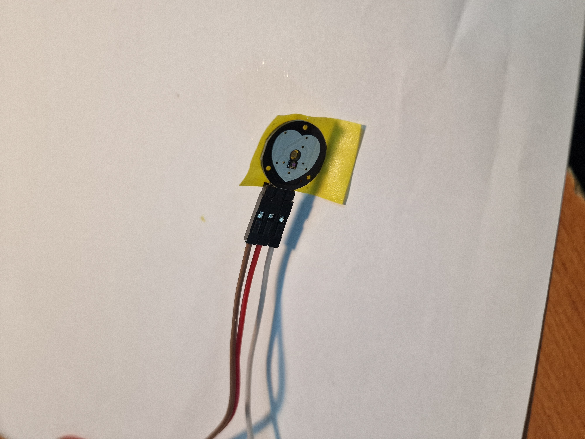

# HugBuddy

## General description
HugBuddy is an innovative pair of teddy bears designed to simulate the comforting sensation of a hug and foster emotional connections, even when loved ones are far apart. Equipped with cutting-edge technology, HugBuddy combines touch, sound, and interactive behavior to create a unique and meaningful communication experience.
### How it works?
When one HugBuddy is hugged, an internal pressure sensor detects the embrace and triggers a Wi-Fi signal to its counterpart. The paired HugBuddy responds by vibrating, replicating the sensation of a hug. To add personality and emotional depth, the bears are equipped with speakers that play pre-recorded messages, such as “You hugged me too hard.” Additionally, HugBuddy features a photoresistor to detect when the lights are turned off, prompting the bear to vibrate and say, “I’m scared,” fostering a sense of companionship and care.
### What was the inpiration?
HugBuddy was inspired by the universal need for human connection and the comfort offered by a simple hug. By integrating the timeless charm of teddy bears with modern technology, HugBuddy aims to create a tangible link between loved ones, bridging emotional gaps in long-distance relationships.
### Why it's useful?
HugBuddy is more than a toy—it’s a step forward in human-device interaction. This project explores the potential of technology to simulate emotional closeness, offering comfort and companionship to individuals separated by distance. HugBuddy could benefit children, long-distance couples, or anyone seeking a sense of connection, while also advancing research in emotional robotics and remote interaction.


## Hardware Design

### Functionality


#### ESP32
- micro controller for this project
- control all the other blocks
- connect over Wi-Fi with the other bear
- power by 3 AA batteries

#### Vibration motor
-  use to simulate the vibration of the teddy bear
- we need to because the motor is very small (1 cm)
- control using digital pins

#### Keyestudio 8002b
- use to tell some default phrases
- control with an analog pin

#### BMP180
- use to detect the pressure when the bear is hugged
- connect via I2C

#### Photocell
- use to determinate the change of the light (to implement the fear of darkness)
- need 2 to be used like eyes
- connect over an analog pin 

#### Pulse sensor
- use to read the pulse of a person in order to simulate it in the other bear
- connect over an analog pin

#### Batteries
- use to power the ESP32 and the other blocks

### Implementation


#### Vibration motor
- work with 80mA, but the ESP32 pins provide just 20-30mA
- add a NPN transistor to can provide a bigger current intensity
- wire ESP32 pin with the base of the NPN transistor, add a resistor to control the current intensity (otherwise the NPN transistor can be burn)
- when the base receive current will close the connection between the vibration motor and the ground pin
- the ESP32 pins for connection can be any output digital pin (do not need an analog pin)
- [wiring tutorial](https://deepbluembedded.com/arduino-vibration-motor-code-circuit/)

#### Keyestudio 8002b
- do not need additional components
- need to be wire to an analog pin in order to can use `tune()` function
- [wiring tutorial](https://www.keyestudio.com/blog/how-to-use-8002b-audio-power-amplifier-with-esp32-225)

#### BPM180
- communicate with ESP32 using I2C
- wire the SDA pin with the ESP32 SDA pin (GPIO 21) and the SCL pin with the ESP32 SCL pin (GPIO 22)
- [wiring tutorial](https://randomnerdtutorials.com/esp32-with-bmp180-barometric-sensor/)

#### Photocell
- wire a photocell with an resistor (in order to scale the current intensity)
- connect the circuit at 3.3V and at ground
- read the value of the photocell resistance using an analog input pin from ESP32 (GPIO39, GPIO34)
- [wiring tutorial](https://esp32io.com/tutorials/esp32-light-sensor)

#### Pulse sensor
- wire at 3.3V and ground pins
- wire the signal pin to an analog input pin from ESP32 (GPIO 36)
- [wiring tutorial](https://microcontrollerslab.com/pulse-sensor-esp32-tutorial/)

#### Battery
- to power the ESP32 and all the other blocks
- connect the + to VIN from ESP32 and the - to GND
- [wiring tutorial](https://linuxhint.com/power-esp32-battery/)

### Bill of materials
The proprieties of the component were generated using Fritzing app. The whole project can be find [here](./images/schita.fzz)

| Amount | Part Type                                      | Properties                                                                                                                                                                | Datasheet                                                                                                                                                 | Image         |
|--------|------------------------------------------------|--------------------------------------------------------------------------------------------------------------------------------------------------------------------------|----------------------------------------------------------------------------------------------------------------------------------------------------------|---------------|
| 3      | Battery Holders                               | voltage 1.2V; package battery-aa-kit; variant aa-kit; internal resistance 0.1Ω                                                                                           |                                                                                                                                                          |               |
| 2      | NPN-Transistor                                | package TO92 [THT]; type NPN (EBC)                                                                                                                                       | [Datasheet](https://www.sparkfun.com/datasheets/Components/BC546.pdf)                                                                                   |      |
| 1      | Barometric Pressure Sensor - BMP180 Breakout (GY-68) | chip BMP180; variant variant 3                                                                                                                                           | [Datasheet](https://cdn-shop.adafruit.com/datasheets/BST-BMP180-DS000-09.pdf)                                                                            |     |
| 1      | ESP32S-HiLetgo                                | variant HiLetgo; type NudeMCU-32S; pins 38; part # ESP32S-HiLetgo                                                                                                       | [Datasheet](https://www.espressif.com/sites/default/files/documentation/esp32_datasheet_en.pdf) [Pinout Reference](https://lastminuteengineers.com/esp32-pinout-reference/) |      |
| 1      | Keyestudio 8002B                              | variant variant 1                                                                                                                                                        | [Datasheet 1](https://wiki.keyestudio.com/KS0374_keyestudio_Power_Amplifier_Module) [Datasheet 2](https://www.keyestudio.com/blog/how-to-use-8002b-audio-power-amplifier-with-esp32-225) |      |
| 2      | Photocell (LDR)                               | dark resistance @0.01lx 300kΩ; package THT; power 0.25W; light resistance @100lx 400Ω; luminance 10lx                                                                   | [Datasheet](https://www.mouser.com/datasheet/2/737/photocells-932884.pdf?srsltid=AfmBOordjdsNJ4Icbo64gmVYUtEhyTft1gwpifDJjs1EM_v42nWLPoZW)                |  |
| 1      | Pulse Sensor                                  | package SIP; variant variant 1                                                                                                                                           | [Datasheet 1](https://cdn-shop.adafruit.com/product-files/1093/PulseSensorAmpedGettingStartedGuide.pdf) [Datasheet 2](https://www.optimusdigital.ro/ro/index.php?controller=attachment&id_attachment=447&srsltid=AfmBOoq_gU5Ko2xSBZUHxwFK_QClgCfg95LmCOTURWX_54XSfYMxzBmh) |      |
| 2      | 330Ω Resistor                                 | tolerance ±5%; package 0603 [SMD]; resistance 330Ω                                                                                                                       | [Datasheet](https://www.mouser.com/datasheet/2/414/GP-1671375.pdf?srsltid=AfmBOooitb8up3LF_TTmedORVxlq6UULtGa8dP_f_AtcUQPtNcRgwpDB)                       |       |
| 2      | 10kΩ Resistor                                 | tolerance ±5%; package 0603 [SMD]; resistance 10kΩ                                                                                                                       | [Datasheet](https://www.mouser.com/datasheet/2/414/GP-1671375.pdf?srsltid=AfmBOooitb8up3LF_TTmedORVxlq6UULtGa8dP_f_AtcUQPtNcRgwpDB)                       |       |
| 2      | Vibration Motor- ROB-08449                    | package vibe-motor-10mm; variant 10mm                                                                                                                                    | [Datasheet 1](https://www.mouser.com/datasheet/2/321/28821-Flat-Coin-Vibration-Motor-Documentation-369707.pdf?srsltid=AfmBOorlhJBz6bqxh24OIA6QHMYG4CS-eSHEXZp5raEHkIJkOgh_TKIe) [Datasheet 2](https://asset.conrad.com/media10/add/160267/c1/-/en/002298375DS00/datasheet-2298375-tru-components-tc-9193500-5-ks.pdf) |              |

### Physical setup

#### Vibration modules - [video](https://youtube.com/shorts/6yC7BauQsrw?feature=share)
<p>


</p>

---

#### Keyestudio 8002b - [video](https://youtube.com/shorts/pHokNqjklVg?feature=share)
<div align="center">

</div>

---

#### BMP180 - [video](https://youtube.com/shorts/UoWgT8tCj3w?feature=share)
<p>


</p>

---

#### Photocell - [video](https://youtube.com/shorts/r_aeARwO2eg?feature=share)
<p>


</p>

---

#### Pulse sensor
<div align="center">

</div>

---

  


## Software Design

### WiFiConnection library
- main purpose: to handle the WiFi connection between 2 ESP32 and the communication between them

#### External libraries

**WiFi.h**
- [Documentation](https://docs.arduino.cc/libraries/wifi/)
- provide functions for scanning the nearest networks, for connecting to a specific network
- also provide the possibility to create a server that accepts TCP connection, and to create specific clients to connect to other servers

**Preferences.h**
- [Documentation](https://docs.arduino.cc/libraries/preferences/)
- provide a method to save different variables (string, int, float etc.) directly into the flash memory in order to be store even if the running program is closed
- offer the possibility to access variables created on other runs of the program

#### Functions

`wifi_init()`
- this function will be called in the setup stage of the program
- check if we have any connection credentials saved in preferences
  - if **NOT** 
    - scan the nearest network using `wifi_scan()`
    - connect to the selected network using `wifi_connect()`
    - create the connection between this ESP32 and it's pair using `create_friend_connection()`
    - if all goes well save the connection information using `save_preferences()`
  - else
    - set the last IP address used 
    - connect to the saved network
    - create the friend connection
    - if any of this steps fails: delete the saved data from preferences
  - if anything when wrong in this function will return 0 for failure

`wifi_scan()`
- use the WiFi.h scan method the find the nearest networks
- print these network on the serial
- wait for user to select one of the networks
- update the SSID variable with the selected one

`wifi_connect()`
- use the selected SSID and the password provided by the user
- wait for connection 5 seconds and print the local IP address if the connection succeed

`create_friend_connection()`
- create an local server that will accept connection from the buddy ESP32
- try 10 times to connect to the buddy server (using the IP address provided by the user throw serial)
- and also wait for connection from the buddy ESP32
- exchange `HELLO` messages

`save_preferences()`
- use to save the connection details in order to can be used in a other run of the program
- for static IP: local IP, gateway, subnet mask
- for WiFi connection: SSID and password
- for connection with buddy server: buddy IP address

`hug_receive()`
- return 1 if a `HUG` message is received on the server

`hug_send()`
- create a client and connect to the buddy server and send a `HUG` message

### Hugs library
- main purpose: use the pressure sensor the detect a hug and use the motor to simulate a hug

#### External libraries

**Adafruit_BMP085.h**
- [Documentation](https://docs.arduino.cc/libraries/adafruit-bmp085-library/)
- provide functions for connection via I2C to the pressure sensor (Adafruit BMP085) and read the different data from it

#### Functions

`hugs_init()`
- try to initialize the pressure sensor 3 times
- initialize the pins for motor (as output and set them on low)

`hugs_loop()`
- run on each loop call from the main program
- use the functions `hug_simulation()` and `sensor_analyze()`

`hug_simulation()`
- simulate a hug for 2 seconds
- if the hug is on and 2 seconds passed (from the start time until now) set the hug on off and close the motors

`sensor_analyze()`
- read the value of the sensor and get the current state using the no hug, simple hug and hard hug limits
- use debouncing to update the state of the bear (the debouncing time will be 1 second)

`start_hug()`
- set the hug on on, start the motors and set the start time with the current time using `millis()`

### LightSpeaker

#### External libraries

**Talkie.h**
- [Documentation](https://docs.arduino.cc/libraries/talkie/)
- provide functions that will use an digital to analog convert to make a speaker to tell specific works
- provide a collection of over 1000 words that can be used
- can not be use on esp32 directly, need to add manually the library from [this repository](https://github.com/bobh/ESP32Talkie) - and be sure you connect the speaker to 25 pin

**Create new words**
- to create new words we need to take the `.wav` file and convert using [Linear Predictive Coding](https://en.wikipedia.org/wiki/Linear_predictive_coding)
- select what words you want to used (search them in the example folder first to see if they already exists)
- go to [an online text to speech convertor](https://ttsmaker.com/) and create an `.mp3` file for each word (or group of words)
- take these `.mp3` file, go to Audacity and resample the file using *8000 Hz*, and export the file using *unsigned 8-bit* 
- clone the project of [python_wizard](https://github.com/ptwz/python_wizard)
- copy the file inside the project folder and run this command to obtain the encryption to be used with Talkie library
```bash
python3 python_wizard -S -T tms5220 -f arduino test.wav
```
- detailed instruction can be found [here](https://github.com/berrak/wav-files-to-arduino-talkie-lpc#tools-required-for-converting-wav-files-to-lpc-data)

#### Functions

`light_speaker_init()`
- set the photocell pins as input and the speaker as output
- set the speaker on HIGH

`light_speaker_loop()`
- run on each loop call from the main program
- use function `light_analyze()`
  
`light_analyze()`
- read the values of both sensors and if both values are smaller than the dark limit set the stage of `DARK`
- use debouncing to be sure the reading is right

`say_dark()`, `say_hard_hug()` and `say_love()`
- use the created words and the `Talkie.say()` function to tell the whole sentences 

### Main program
- will be the logic of the program
- the `init` functions will be called in the `setup()` function
- in the `loop()` 
  - run the `loop` functions
  - if a hug is received, simulate one here
  - if the bear is hugged when a hug is received make the bear to say **I love you**
  - if the bear is hugged, send a hug message to the other bear
  - if the bear is hugged to hard, say it 
  - if it's dark, make the bear to say it and to be scared

## Results

## Conclusions
